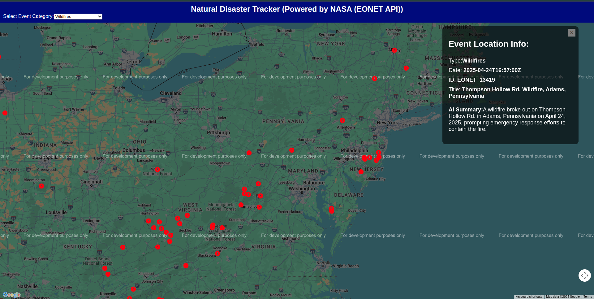

# 🌍 Natural Disaster Tracker App 

A React-based interactive map that allows users to view **natural events** (like wildfires, volcanoes, floods, and more) across the globe in real-time using data from NASA's [EONET API](https://eonet.gsfc.nasa.gov/). Users can filter by event category and view detailed information for each event by clicking on its map marker.

 <!-- Optional: Add a real screenshot -->

---

## ✨ Features

- 🌐 **Interactive Google Maps** with event markers
- 🔎 **Category Filter Dropdown** to display specific types of events (e.g., Wildfires, Volcanoes, Severe Storms)
- 🧭 **Event Info Popup** with event title, date, ID, and type
- ❌ Closeable info box for a better viewing experience
- 🔄 Real-time event data fetched from NASA EONET API

---

## 🛠 Tech Stack

- **Frontend:** React.js, CSS
- **Maps:** @react-google-maps/api
- **Icons:** Iconify
- **Data Source:** [NASA EONET API v2.1](https://eonet.gsfc.nasa.gov/api/v2.1/events)

---

## 🚀 Getting Started

### 1. Clone the repository

```bash
git clone https://github.com/your-username/wildfire-tracker.git
cd wildfire-tracker
```

### 2. Install dependencies

```bash
git clone https://github.com/your-username/wildfire-tracker.git
cd wildfire-tracker
```

### 3. Start the development server
```bash
npm start
```
---

## 🔑 Setup
### Google Maps API Key

To render the map, you need a Google Maps API key.
- Get your key from [Google Cloud Console](https://console.cloud.google.com/)
- Replace the placeholder in Map.js:
```bash
<LoadScript googleMapsApiKey='YOUR_GOOGLE_MAPS_API_KEY'>

```
---

## 🧪 Sample API Endpoints
- Events: https://eonet.gsfc.nasa.gov/api/v2.1/events
- Categories: https://eonet.gsfc.nasa.gov/api/v2.1/categories

---

## 🎥 Walkthrough
Here’s a quick demo of the app in action:


## 🤝 Contributing
Pull requests are welcome! Feel free to fork the repo and submit a PR with improvements.

---

## 🛰️ Credits
- [NASA EONET API](https://eonet.gsfc.nasa.gov/)
- @react-google-maps/api
- [Iconify](https://iconify.design/)

---

Built with ❤️ by Rucha Daware
